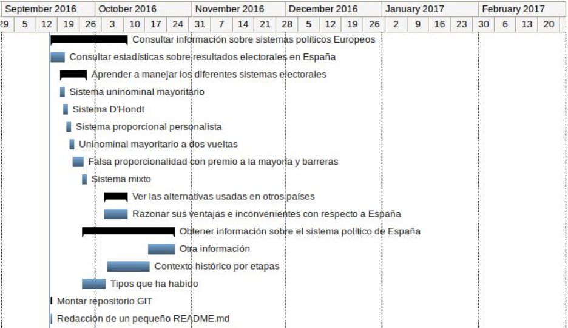
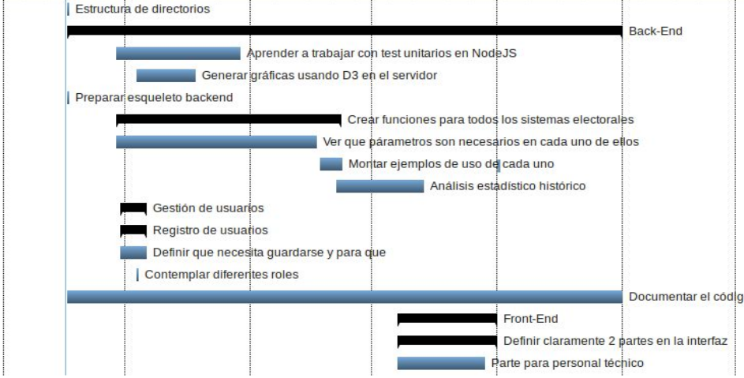
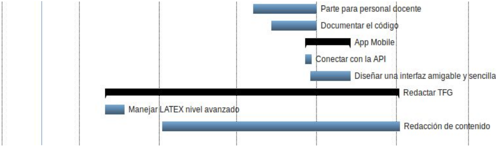

# Estimación de tiempos y progreso #

| Tarea 													        | Duración | Comienzo   | Fin        | Estado             |
| ----------------------------------------------------------------- | -------- | ---------- | ---------- | ------------------ |
| A. __Consultar información sobre sistemas políticos europeos__    | 17       | 16/09/2016 | 10/10/2016 | :x:	  			  |
| A.1 Consultar estadísticas sobre resultados electorales en España |  3       | 16/09/2016 | 20/09/2016 | :x:	  			  |
| A.2 __Aprender a manejar los diferentes sistemas electorales__	|  7	   | 19/09/2016 | 27/09/2016 | :x:	  			  |
| A.2.1 Sistema uninominal mayoritario								|  2	   | 19/09/2016 | 20/09/2016 | :white_check_mark: |
| A.2.2 Sistema D'Hondt												|  2	   | 20/09/2016 | 21/09/2016 | :white_check_mark: |
| A.2.3 Sistema proporcional personalista							|  2	   | 21/09/2016 | 22/09/2016 | :x:	  			  |
| A.2.4 Sistema uninominal mayoritario a dos vueltas				|  2 	   | 22/09/2016 | 23/09/2016 | :x:	  			  |
| A.2.5 Sistema de falsa proporcionalidad a la mayoría(y barreras)  |  2	   | 23/09/2016 | 26/09/2016 | :x:	  			  |
| A.2.6 Sistema mixto												|  2	   | 26/09/2016 | 27/09/2016 | :x:	  			  |
| A.3 __Ver alternativas usadas en otros países__					|  6	   | 03/10/2016 | 10/10/2016 | :x:	  			  |
| A.3.1 Razonar sus ventajas e inconvenientes con respecto a España |  6	   | 03/10/2016 | 10/10/2016 | :x:	  			  |
| B. __Obtener información sobre el sistema político de España__ 	| 22	   | 26/09/2016 | 25/10/2026 | :x:	  			  |
| B.1 Tipos que ha habido											|  6	   | 26/09/2016 | 03/10/2016 | :x:	  			  |
| B.2 Contexto histórico por etapas									| 10	   | 04/10/2016 | 17/10/2016 | :x:	  			  |
| B.3 Otra información												|  7	   | 17/10/2016 | 25/10/2016 | :x:	  			  |
| C. __Montar repositorio GIT__										|  1 	   | 16/09/2016 | 16/09/2016 | :white_check_mark: |
| C.1 Redacción de un pequeño README.md de bienvenida				|  1	   | 16/09/2016 | 16/09/2016 | :white_check_mark: |
| C.2 Estructurar directorios										|  1	   | 16/09/2016 | 16/09/2016 | :white_check_mark: |
| D. __Back-End__													| 97	   | 16/09/2016 | 30/01/2017 | :x:	  			  |
| D.1 Aprender a trabajar con test unitarios en NodeJS				| 23	   | 28/09/2016 | 28/10/2016 | :x:	  			  |
| D.2 Generar gráficas usando D3 en el servidor						| 11 	   | 03/10/2016 | 17/10/2016 | :x:	  			  |
| D.3 Preparar esqueleto Back-End 									|  1 	   | 16/09/2016 | 16/09/2016 | :white_check_mark: |
| D.4 __Desarrollar funciones para simular los sistemas electorales__ | 40	   | 28/09/2016 | 22/11/2016 | :x:	  			  |
| D.4.1 Ver qué parámetros son necesarios en cada uno de ellos	 	| 36	   | 28/09/2016 | 16/11/2016 | :x:	  			  |
| D.4.2 Montar ejemplos de uso de cada uno 							|  4       | 17/11/2016 | 22/11/2016 | :x:	  			  |
| D.5 Análisis estadístico histórico								| 16       | 21/11/2016 | 12/12/2016 | :x:	  			  |
| D.6 __Gestión de usuarios__										|  5 	   | 29/09/2016 | 05/10/2016 | :x:	  			  |
| D.6.1 Registro de ususarios										|  5 	   | 29/09/2016 | 05/10/2016 | :x:	  			  |
| D.6.1.1 Definir que necesita guardarse y para que					|  5	   | 29/09/2016 | 05/10/2016 | :x:	  			  |
| D.6.2 Contemplar diferentes roles									|  1  	   | 03/10/2016 | 03/10/2016 | :x:	  			  |
| D.7 Documentar el código										    | 97       | 16/09/2016 | 30/01/2017 | :x:	  			  |
| E. __Front-End__													| 19	   | 06/12/2016 | 30/12/2016 | :zzz:  			  |
| E.1 Definir 2 partes en la interfaz								| 19 	   | 06/12/2016 | 30/12/2016 | :zzz:  			  |
| E.1.1 Parte para personal técnico									| 16       | 06/12/2016 | 27/12/2016 | :zzz:  			  |
| E.1.2 Parte para personal docente								    | 19 	   | 06/12/2016 | 30/12/2016 | :zzz:  			  |
| E.2 Documentar el código											| 14	   | 13/12/2016 | 30/12/2016 | :zzz:  			  |
| F. __App mobile__													| 14 	   | 26/12/2016 | 12/01/2017 | :zzz:  			  |
| F.1 Conectar con la API											|  3 	   | 26/12/2016 | 28/12/2016 | :zzz:  			  |
| F.2 Diseñar una interfaz amigable y sencilla						| 12	   | 28/12/2016 | 12/01/2017 | :zzz:  			  |
| G. __Redactar TFG__ 												| 82 	   | 10/10/2016 | 31/01/2017 | :x:	  			  |
| G.1 Aprender a usar LaTex de forma profesional					|  6       | 10/10/2016 | 17/10/2017 | :x:	  			  |
| G.2 Redacción del contenido propio del TFG						| 66	   | 01/11/2016 | 31/01/2017 | :zzz:  			  |

### Leyenda ###

:white_check_mark: => Tarea ya desarrollada a fecha de hoy.

:x: => Tarea no desarrollada a día de hoy, en progreso.

:zzz: => Tarea no desarrollada a día de hoy, no comenzada.

## Diagrama de Gantt ##

